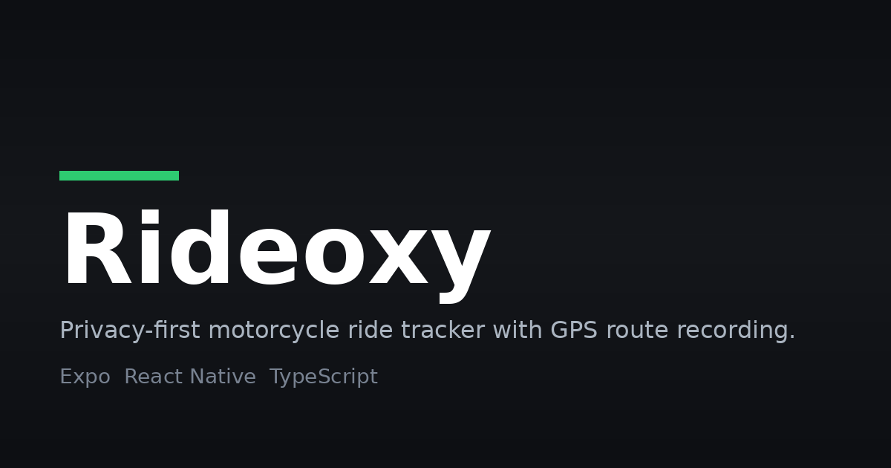

# Rideoxy



> Privacy-first, offline-ready motorcycle ride tracking and fuel telemetry app.

 

## What

Rideoxy is a mobile application built for motorcyclists. Track your rides, monitor speeds, analyze fuel efficiency, record maintenance logs, and export your GPX routes, all with complete privacy and zero mandatory cloud accounts.

## Why

Built as a personal project: a privacy-first alternative to cloud-locked ride trackers, made for motorcyclists who want their ride data to stay on their own phone.

## When

September 2026.

---

## Features

- **Precision Ride Tracking**: Background GPS logging with noise filtering, accurate distance calculation (Haversine algorithm), and speed analysis.
- **Offline-Ready Maps**: Vector map rendering powered by MapLibre GL Native.
- **Fuel and Maintenance Log**: Track fill-ups, calculate mileage (km/L and MPG), cost per km, and service intervals.
- **Comprehensive Statistics**: Lifetime distance, top speeds, average speeds, monthly breakdowns, and ride history.
- **GPX Route Export**: Export any recorded ride to standard `.gpx` files to share or import into Google Earth, Strava, or Garmin.
- **100% Local and Private**: All ride data, track points, and garage records are stored locally using SQLite on your device.

---

## Tech Stack

     

- **Language**: TypeScript
- **Framework**: [Expo](https://expo.dev/) (SDK 54) and [React Native](https://reactnative.dev/) (0.81)
- **Routing**: [Expo Router](https://docs.expo.dev/router/introduction/)
- **Maps**: [@maplibre/maplibre-react-native](https://github.com/maplibre/maplibre-react-native)
- **Database**: [Expo SQLite](https://docs.expo.dev/versions/latest/sdk/sqlite/)
- **Background GPS**: [Expo Location](https://docs.expo.dev/versions/latest/sdk/location/) and [Expo TaskManager](https://docs.expo.dev/versions/latest/sdk/task-manager/)
- **File Export and Sharing**: Expo FileSystem and Expo Sharing
- **Animations and UI**: React Native Reanimated, Lucide Icons, Safe Area Context

### Why We Used This

- **Expo**: one codebase that builds for both iOS and Android, with managed native modules for the features the app depends on.
- **Expo Location + TaskManager**: keep GPS logging alive in the background while you ride, even with the screen off.
- **Expo SQLite**: all rides, track points, fuel logs, and settings stay in an on-device database, which is what makes the app fully private with no server or account needed.
- **MapLibre GL Native**: vector maps that render recorded routes and work with offline map tiles.
- **TypeScript**: type safety across screens, repositories, and services so GPS data shapes stay consistent.
- **Expo FileSystem + Expo Sharing**: write GPX files to the device and open them in Google Earth, Strava, or Garmin.
- **React Native Reanimated**: smooth animations on the live speed HUD and charts.

---

## How It Works

- **Start a ride** from the home tab. The live HUD screen (`app/active-ride.tsx`) shows your speed and current position on the map.
- **Background tracking** runs through an Expo TaskManager location task (`tasks/locationTask.ts`), which keeps recording GPS points while you ride, screen on or off.
- **Filtering and math** happen in `services/`: `gpsFilter` cleans noisy fixes, `distance` computes segment distances with the Haversine formula, and `fuelCalculation` derives mileage and cost per km.
- **Everything is stored locally** in SQLite through the repository layer in `database/` (rides, track points, fuel entries, garage records, settings).
- **Stats and History tabs** aggregate lifetime distance, top speeds, average speeds, and monthly breakdowns from the stored data.
- **Fuel tab** logs fill-ups and computes mileage (km/L and MPG), cost per km, and service reminders.
- **Export** turns any recorded ride into a standard `.gpx` file that you can share or import elsewhere.

---

## Quick Start

### Prerequisites

- [Node.js](https://nodejs.org/) v20 or later (v20+ recommended)
- [npm](https://www.npmjs.com/) (bundled with Node.js) or [yarn](https://yarnpkg.com/)
- [Expo CLI](https://docs.expo.dev/more/expo-cli/) via `npx expo`
- Expo SDK 54 and React Native 0.81, as pinned in `package.json`

### Installation

1. Clone the repository:
   ```bash
   git clone https://github.com/p3xz/rideoxy.git
   cd rideoxy
   ```

2. Install dependencies:
   ```bash
   npm install
   ```

3. Start the development server:
   ```bash
   npx expo start
   ```

---

## Usage

Start the development server and scan the QR code with Expo Go to run the app on your phone:

```bash
npx expo start
```

From the home tab, start a ride. The live HUD shows your speed and position on the map, and background tracking keeps recording GPS points while you ride.

### Building for iOS (100% free, no paid Apple Developer account)

You do not need a paid Apple Developer account to build and run Rideoxy on your iPhone from Windows.

**Method 1: Automated GitHub Actions (.ipa build)**

1. Push your changes to GitHub.
2. Go to the **Actions** tab in your GitHub repository.
3. Select the **`Build iOS IPA (Free / No Apple Dev Account)`** workflow.
4. Click **Run workflow** on the `master` branch.
5. Once the build completes, download the **`rideoxy-ios-ipa`** artifact.
6. Connect your iPhone to your Windows PC via USB and install using **[Sideloadly](https://sideloadly.io/)** with your free personal Apple ID.

**Method 2: EAS iOS simulator build**

If testing on an iOS Simulator or macOS:

```bash
npx eas-cli build -p ios -e simulator
```

### Building for Android

Build a standalone APK or AAB for Android using EAS:

```bash
npx eas-cli build -p android -e preview
```

---

## Project Structure

```
├── app/                  # Expo Router navigation and screens
│   ├── (tabs)/           # Bottom tab bar screens (Home, Garage, Stats, History, Fuel, Settings)
│   ├── active-ride.tsx   # Live HUD and GPS tracking screen
│   ├── fuel-entry.tsx    # Fuel fill-up input modal
│   └── ride-summary.tsx  # Post-ride summary and stats
├── components/           # Reusable UI components (SpeedDisplay, RideMap, Cards)
├── constants/            # Color palettes, GPS configuration, map themes
├── database/             # SQLite schema, migrations, and repositories
├── services/             # GPS filtering, distance calculations, GPX exporter, tracking engine
├── tasks/                # Background location task definitions
└── types/                # TypeScript data interfaces
```

---

## Credits

**Namish Yadav**
- GitHub: [https://github.com/p3xz](https://github.com/p3xz)
- LinkedIn: [https://www.linkedin.com/in/namish-yadav-639769408/](https://www.linkedin.com/in/namish-yadav-639769408/)
- Instagram: [https://instagram.com/nam7sh](https://instagram.com/nam7sh)

---

## Contributing

Issues and pull requests are welcome. Please keep changes small and focused, with clear commit messages.

---

## License

This project is licensed under the MIT License. See the [LICENSE](LICENSE) file for details.
